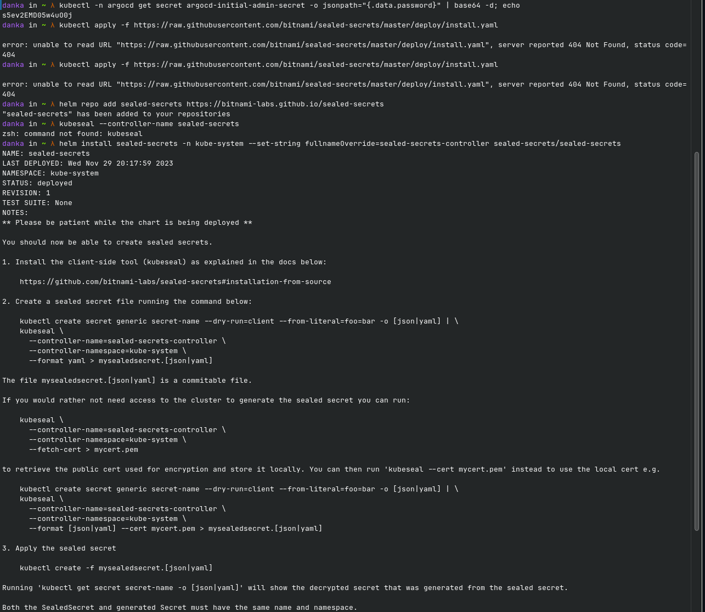
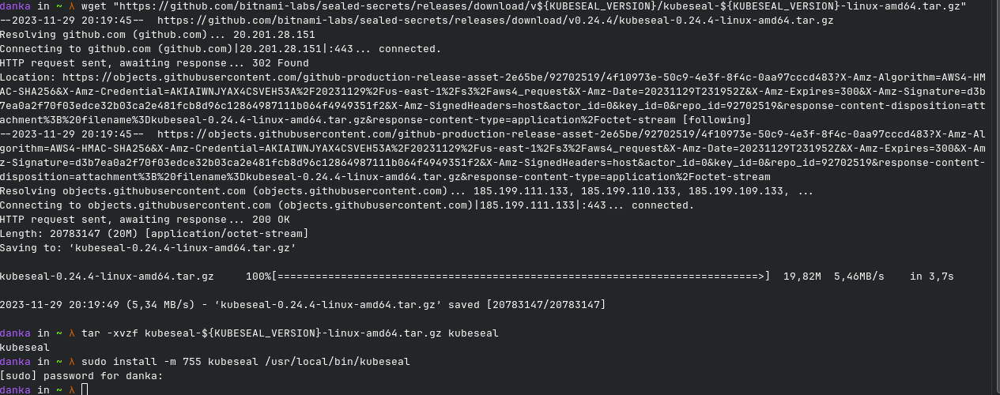
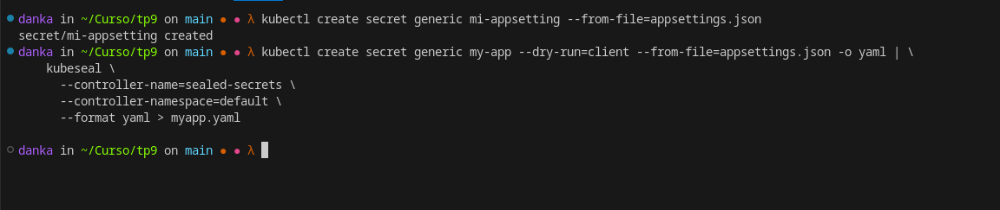
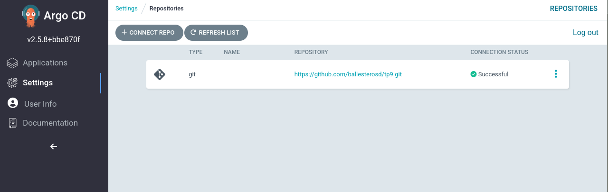
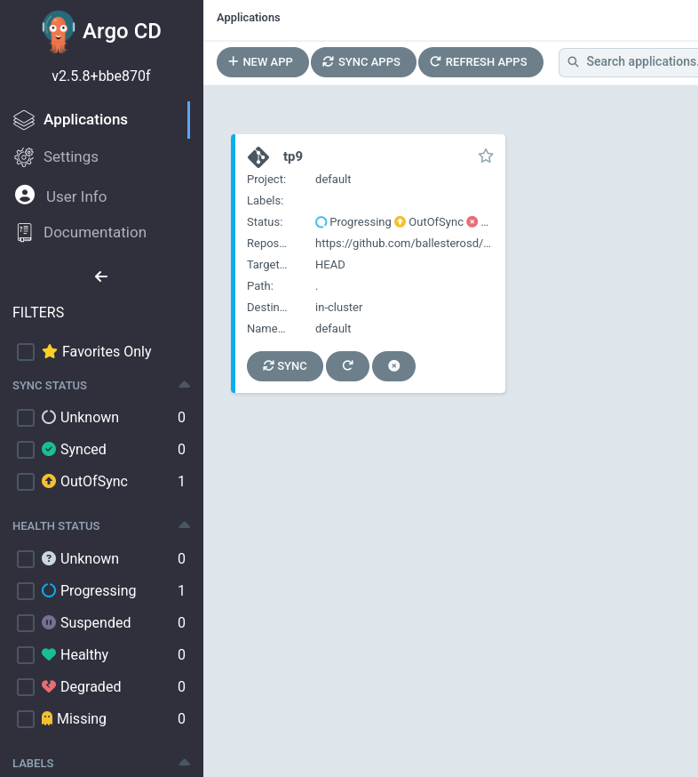

# Pasos

Instalacion de argocd  
```
kubectl apply -n argocd -f https://raw.githubusercontent.com/argoproj/argo-cd/v2.5.8/manifests/install.yaml
```

Instalacion de sealed secret   



Creacion del sealed secret


Creacion de la aplicacion en argocd  
  
  
